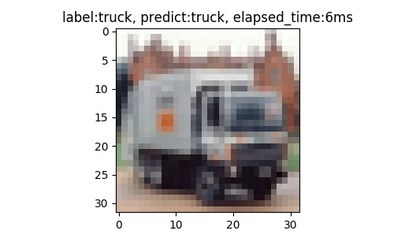
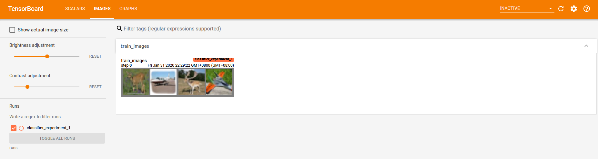
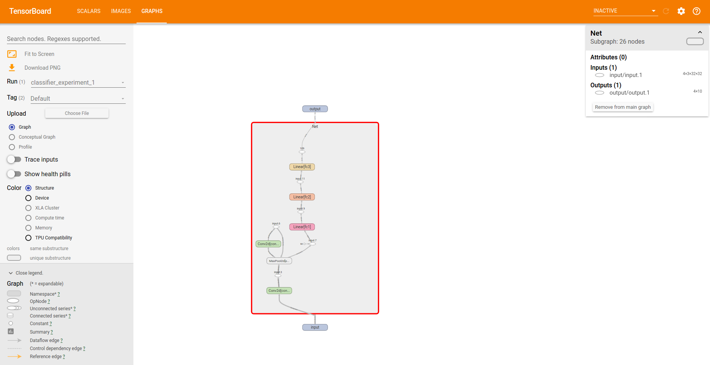
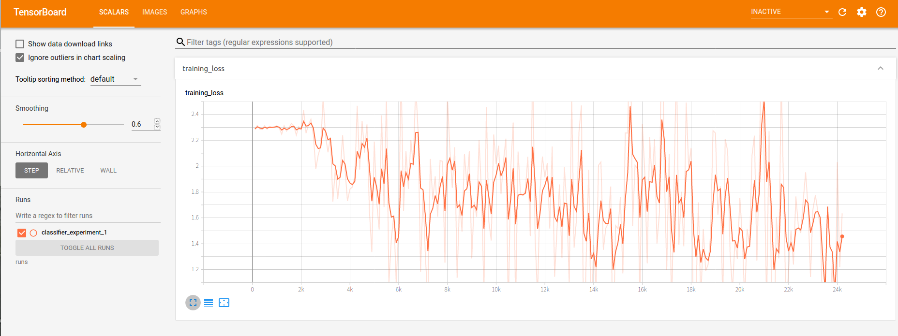

<p align="center"></p>

---------------------------

# pytorch-flying-fish 
作为一个新手，想开始进入深度学习领域做一名炼丹师。通过一个最简的原型来学习一下pytorch的玩法。

## 0.准备工作
使用conda创建虚拟环境
```
conda create -n pytorch-qs python=3.7 -y
conda activate pytorch-qs
```

安装PyTorch and torchvision，参照[官网](https://pytorch.org/),例如：
```
conda install pytorch torchvision cudatoolkit=10.0 -c pytorch
```

克隆本项目
```
git clone https://github.com/tianzhihen/pytorch_quick_start.git
cd pytorch_quick_start
```

安装依赖包
```
pip install -r requirements.txt
```

training
```
bash experiments/main.sh
```

demo
```
bash experiments/demo.sh
```




## 1.架构

1. [x] 实现简单的Neural Network、支持training、testing
1. [x] 在GPU下训练
1. [x] 接入tensorboard
1. [x] 模型导入导出
1. [x] demo pipeline，进行inference并输出预测结果
1. [x] 抽象配置
1. [ ] 加入resnet做为backbone，提高性能
1. [ ] 简易的benchmark
1. [ ] 使用hook重构
1. [ ] 适配多个数据集
1. [ ] dataloader异步加速

## 2.实现简单的Neural Network
通过pytorch的60min教程搭建一个包含conv层maxpooling层以及relu激活函数的nn，官网[链接](https://pytorch.org/tutorials/beginner/blitz/neural_networks_tutorial.html#sphx-glr-beginner-blitz-neural-networks-tutorial-py)

neural network 各层的输入输出关系，可以通过LeNet的说明进行理解。


## 3. GPU训练
将net放到gpu上：
```
net.to(device)
```
将输入数据放入到gpu上：
```
inputs, labels = inputs.to(device), labels.to(device)
```


## 4.接入tensor_board
观察图像：
```
writer.add_image('train_images', img)
```
观察网络结构：
```
writer.add_graph(net, images)
```

观察loss：
```
writer.add_scalar('training loss', loss, index * len(trainloader) + i)
```

开启tensorboard：
```
tensorboard --logdir=runs --host=0.0.0.0
```

图像示例：


网络结构示例：


loss示例：


## 5.模型导出、导入
模型导出，使用推荐导出方法：
```
torch.save(net.state_dict(), model_output_path)
```
模型导入，需要和导出方法相匹配：
```
net.load_state_dict(torch.load(model_output_path))
```

## 6.加入demo pipeline
为了能够单独使用导出的模型，加入了 `classifier_demo_pipeline.py`

为了能够方便的导入模型，将网络的定义单独提取到networks/simple_net中，使得`classifier_train.py`、`classifier_demo_pipeline.py`可以复用网络结构

## 7.抽象配置
使用argparse对配置进行抽象，仿照了[centernet](https://github.com/xingyizhou/CenterNet/tree/master/experiments)对配置进行了抽象，
并仿照其目录结构对项目的train、demo两步进行了分离
