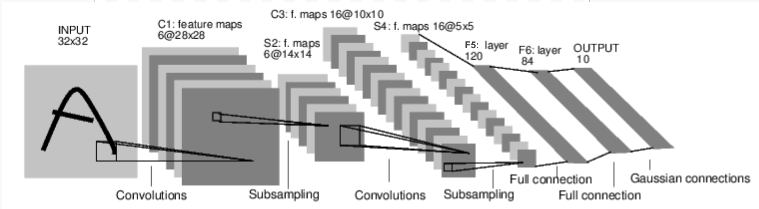
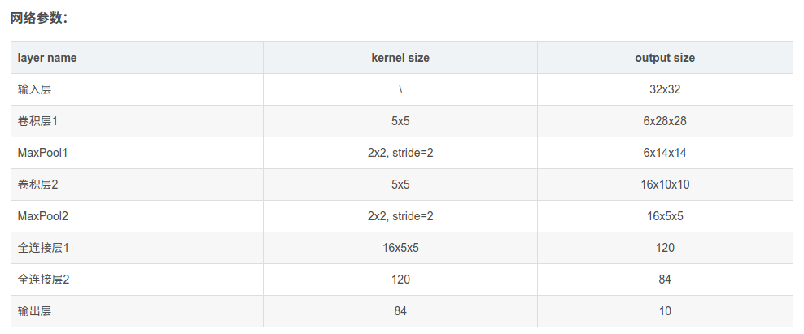

# pytorch_quick_start
作为一个新手，想开始进入深度学习领域做一名炼丹师。通过一个最简的原型来学习一下pytorch的玩法。

## 0.架构

1. [x] 实现简单的Neural Network、支持training、testing
1. [ ] 接入tensor_board
1. [ ] 简易的benchmark
1. [ ] 在GPU下训练
1. [ ] 适配多个数据集
1. [ ] dataloader 异步加速
1. [ ] 加入resnet 做为backbone
1. [ ] 抽象配置文件

## 1.实现简单的Neural Network
通过pytorch的60min教程搭建一个包含conv层maxpooling层以及relu激活函数的nn，官网[链接](https://pytorch.org/tutorials/beginner/blitz/neural_networks_tutorial.html#sphx-glr-beginner-blitz-neural-networks-tutorial-py)

neural network 各层的输入输出关系，可以通过LeNet的说明进行理解。

## 2.接入tensor_board

 